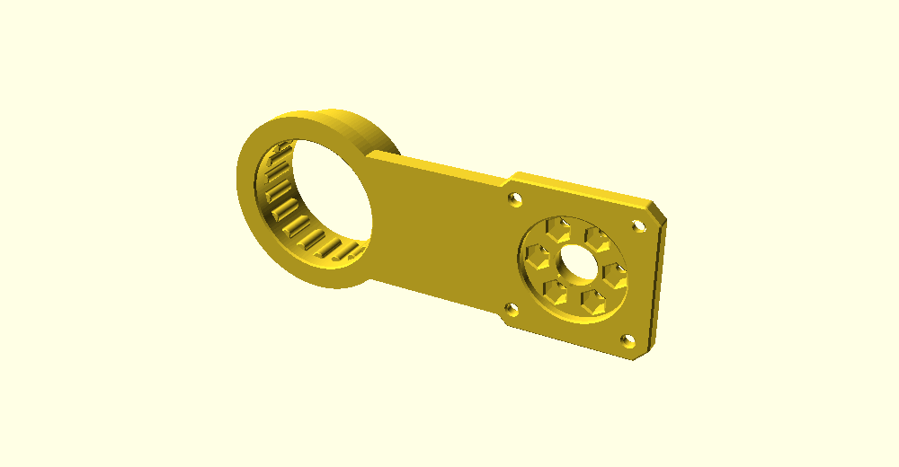

# 3D-Printed Cycloidal Robot Arm

A 3D-printable cycloidal robot arm, designed for **low backlash**, **commodity
parts** (NEMA17, 608 bearings, magnets), and **fast iteration** on a home
printer. Two design tracks live here:

- **Integrated-actuator arm (current direction).** A **5-DOF** arm built from
  printed **sections** that fuse directly to off-the-shelf
  [Sweep Dynamics](https://www.sweepdynamics.com) **20:1 Micro Cycloidal**
  drives (a larger cycloidal at the base slew). Each section integrates one
  half of a joint at each end — the rotating cyclo **body** (upstream joint
  output) on one end, the **NEMA17 motor plate** (downstream motor mount) on
  the other — so the link *is* the actuator mount. See `arm_section.scad`.
- **From-scratch parametric joint (original track).** A **3-DOF** positioning
  trunk built around **one parametric cycloidal joint** (`cycloid_joint.scad`)
  used three times — no bought actuators. Kept as the ground-up alternative.



**Full design rationale → [DESIGN.md](DESIGN.md).** This README is the map.

## Status
Active. **Current focus:** the integrated-actuator arm — the long arm section
is modeled and prints as one fused solid; the two 90° end sections (base→slew,
wrist→tool-roll) are next. No part is finalized for print yet.
**Toolchain:** the CAD is **[build123d](https://build123d.readthedocs.io)**
(Python + OCC) — it imports the vendor STEP files as exact solids, a better fit
for the fused-actuator parts than mesh import. The old OpenSCAD `.scad` sources
are **deprecated** and archived in [`legacy/`](legacy/README.md).

## Headline specs
| | |
|---|---|
| Near-term DOF | **3** (positioning trunk: J1 yaw + J2 shoulder + J3 elbow) |
| Future DOF | 5–6 via parked wrist / BLDC upgrades |
| Payload | 250 g |
| Reach | ~480 mm from shoulder |
| Print volume target | 250 mm cube |
| Joint drive | NEMA17 → 2:1 GT2 belt → cycloid (18:1) = **36:1** |
| Output bearing | large BB crossed-roller, **outboard of the gears** (J1's = the moment bearing) |
| Feedback | output-side absolute magnetic encoder per joint |

## Key decisions (the short version)
- **One cycloidal joint, three sizes** — build/tune once, reprint to scale.
- **Floating-roller cycloid** — nylon rollers, clearance sets backlash, SLA
  bearing surfaces for finish. No steel dowels required.
- **Bearing outboard of the gearset** (clevis-free stator/rotor cartridge) →
  carries the cantilever moment; **J1 = same cartridge vertical**, bearing sized up.
- **3 DOF is useful** — three joints position the tool point; bolt on a fixed
  gripper or manual wrist. Extra DOF is a deliberate later step, not v1.
- **Explorations parked, not deleted** — cable drive, wrist, BLDC, harmonic
  all live in [`parked/`](parked/) for when the trunk proves out.

## Repo map
**Build path (root)**
- `arm_section.py` — **the integrated-actuator links** (build123d, current
  direction). `python arm_section.py upper` fuses the Sweep micro-cyclo body +
  NEMA17 plate (exact STEP solids) into one printable section → `out/`.
- `arm_assembly.py` — **the assembled robot, the single source of truth.**
  Defines the kinematic chain once, derives joint frames from the part geometry,
  and generates the sim model (`sim/arm_trunk.urdf`), the meshes, and a CAD
  preview. Change a section length / motor here and it flows everywhere.
- `extract_vendor_steps.py` — pulls the two parts out of your purchased
  assembly STEP (run once before `arm_section.py` / `arm_assembly.py`).
- `vendor/` — the two Sweep Dynamics input parts + how to get the rest
  ([`vendor/README.md`](vendor/README.md)). Paid geometry — read [`NOTICE`](NOTICE).
- `encoder_joint_spec.md` — integrated output-side encoder.
- `DESIGN.md` — source of truth.
- [`legacy/`](legacy/README.md) — **deprecated** OpenSCAD `.scad` sources
  (`arm_section`, plus the from-scratch `cycloid_joint`/`arm_trunk` 3-DOF track).

**Simulation & analysis** → [`sim/`](sim/README.md) — MuJoCo model + tools to
pose it, size the motors (torque/reach/motor-catalog), budget backlash, watch it
hold/sag under gravity, and run a closed-loop reach controller (the digital-twin
foundation). Where the motor/reduction/backlash trade-offs were quantified.

**Parked explorations** → [`parked/`](parked/README.md) — cable/capstan drive,
wrist mechanisms, harmonic ring, BLDC motor options + integrated actuator,
and the now-merged joint-source files.

## Building the CAD
[build123d](https://build123d.readthedocs.io) (`pip install build123d`):
```bash
python extract_vendor_steps.py          # once: pull the 2 parts from your STEP
python arm_section.py upper             # -> out/upper.stl + out/upper.step
```
> Needs the **vendor geometry you purchase** from Sweep Dynamics (the assembly
> STEP) — see [`vendor/README.md`](vendor/README.md) and [`NOTICE`](NOTICE).
> Deprecated OpenSCAD versions render with `openscad` from [`legacy/`](legacy/README.md).

## Prototype plan
1. **One joint (J2)** — print the disc, pin ring, cam, flange + BB race;
   assemble with a NEMA17 + belt; measure backlash, repeatability, friction.
2. **J1 base** — same cartridge vertical; load-test the moment bearing.
3. **Trunk** — J1+J2+J3 + links; verify reach, stiffness, repeatability.
4. Then revisit a wrist (from `parked/`) for 5–6 DOF.

## References
- Cable-transmission arms (Barrett WAM, UC Berkeley Blue) — remote-cable inspiration.
- [Mishin Machine](https://youtube.com/@MishinMachine) — printed cable/wave-gear robotics.
- [Morse Dynamics](https://instagram.com/morsedynamics) — related printed robotics / drivetrains.
- [Skyentific](https://youtube.com/@Skyentific) — printed BLDC + cycloidal joint actuators.

## License & attribution
This project's own work (CAD source, simulation, docs) is **MIT** licensed
([`LICENSE`](LICENSE)). It is **not** affiliated with Sweep Dynamics. The two
bundled actuator meshes under `vendor/` are Sweep Dynamics' paid geometry,
included as derivative-design input with attribution — see [`NOTICE`](NOTICE).
Buy the actuators at [sweepdynamics.com](https://www.sweepdynamics.com).

---
*Developed iteratively; see DESIGN.md for the full reasoning and the parked alternatives.*
